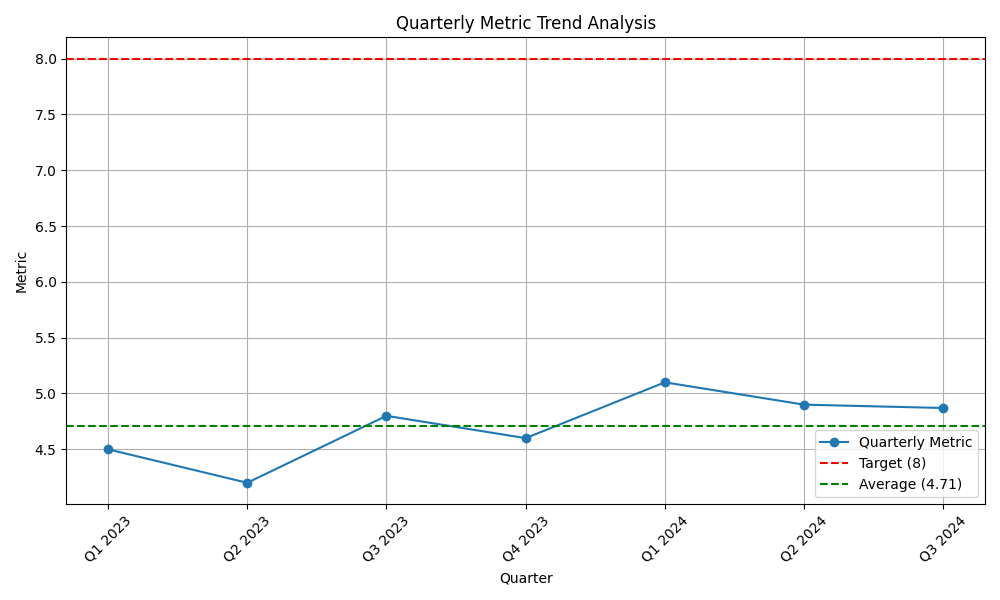

# Quarterly Performance Analysis

This report details the analysis of our quarterly performance metric, benchmarked against a target of 8. The analysis identifies a concerning trend and provides recommendations to address it.

Contact: 23f3001761@ds.study.iitm.ac.in

## Data Visualization

The following chart illustrates our performance over the last seven quarters.

## Key Findings

The analysis of the quarterly data reveals several key findings:

- **Average Performance:** The average metric over the past seven quarters is **4.71**, which is significantly below our target of 8.
- **Stagnant Growth:** Despite minor fluctuations, the metric has shown no significant upward trend and appears to be stagnating.
- **Performance Gap:** There is a persistent gap of over 3 points between our current performance and the target.

## Business Implications

The current trend has several negative business implications:

- **Missed Targets:** We are consistently failing to meet our business objectives, which could impact revenue and stakeholder confidence.
- **Competitive Disadvantage:** Our performance is lagging, which may allow competitors to capture a larger market share.
- **Operational Inefficiencies:** The stagnant metric suggests underlying issues in our processes that need to be addressed.

## Recommendations

To bridge the performance gap and reach our target of 8, we must take immediate action. The following recommendations are proposed:

- **Optimize Supply Chain:** An in-depth review of our supply chain is needed to identify bottlenecks and inefficiencies. Streamlining this process will reduce costs and improve delivery times.
- **Enhance Demand Forecasting:** We need to adopt more sophisticated demand forecasting models to align our inventory with customer demand, reducing both overstocking and stockouts.

By implementing these solutions, we can expect to see a significant improvement in our performance metric and move closer to achieving our business goals.
